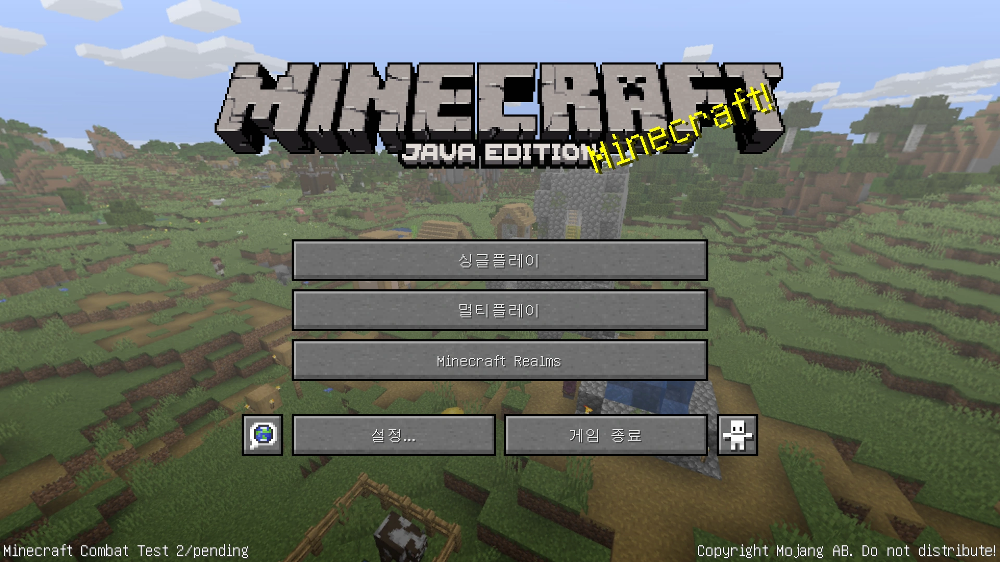

<!--_color: rgb(170,90,70)-->
# <!--fit--> MINECRAFT VR
## &nbsp;&nbsp;&nbsp;&nbsp;&nbsp;&nbsp;&nbsp;&nbsp;&nbsp;&nbsp;&nbsp;&nbsp;&nbsp;&nbsp;&nbsp;&nbsp;&nbsp;&nbsp;&nbsp;&nbsp;&nbsp;&nbsp;&nbsp;&nbsp;&nbsp;&nbsp;&nbsp;&nbsp;&nbsp;&nbsp;&nbsp;&nbsp;&nbsp;&nbsp;&nbsp;&nbsp;&nbsp;&nbsp;&nbsp;&nbsp;&nbsp;&nbsp;&nbsp; - _java edition_ -

---

# Trial 1 -> fail

오큘러스 상에서 내 컴퓨터 상에 있는 Microsoft Luncher(자바 에디션 사용.)
를 실행해봄.

fail--> 조이스틱을 사용하여 컨트롤이 안됨. 
조이스틱을 화면에 가져다 대면 
화면이 계속해서 돌아 실행 불가.
(보는 사람도 어지러움.)

오큘러스 상의 마인크래프트 창 하단에 '키보드'를 열어서 실행해봄--> fail.

w,a,s,d 키와 space바 등, 사용이 가능하지만, 방향을 잡지 못한다.
(키보드로는 일부 문제를 해결하나, 마우스를 통해 사용하는 데 문제가 있다.)

---

# Trial 2 -> fail

마인크래프트 유튜브 상에서 추천하는 방법으로 실행.

링크: https://www.youtube.com/watch?v=1W0kz0ALEFg

fail.
why? --> 모든 파일 설치 실행 하다가 다른 프로그램(압축 프로그램)이 같이 깔림. 
apk 파일 설치가 안됨. 

---

# Trial 3 Steam 설치 -> fail

마인크래프트 공식 사이트 상에서 제공하는 방법.

링크: https://help.minecraft.net/hc/en-us/articles/360057619052

※ 오큘러스 링크 먼저 키고 컴퓨터에서 실행 한 다음, 'steam vr' 실행 시키기(반대로 시행 시, 스팀과 연결되지 않음.)

※ Windows 용 마인크래프트만 가능.
Minecraft Launcher에 들어가서 
Windows 마인크래프트 설치.

---

# Trial 4 Sidequest 앱 설치-> success

링크: https://www.youtube.com/watch?v=Ni_68ddyfG0

- 간단하게 설치 가능.

---

# 설치 방법 설명
※ 마인크래프트 계정이 있어야 가능하다.

---

1. PC 상에서 사이드 퀘스트 설치
2. 휴대폰과 기기 연결하기, 개발자 모드로 변경(생략가능(?)) 
3. 오큘러스 기기 키고(초록불 다 들어와있는 지 확인.) 사이드 퀘스트 상에서 제공하는 해당 번호 마이크로 소프트 상에서 적기.
4. 앱 실행 시키고 로그인 하기.

---

# 조이스틱 이용방법