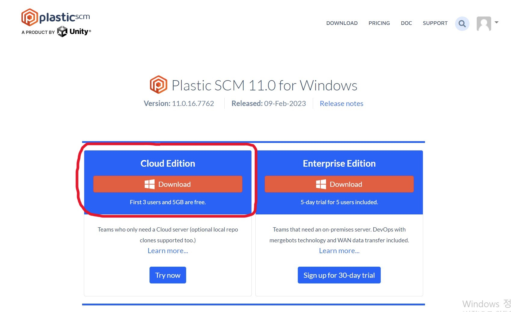
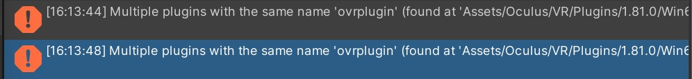
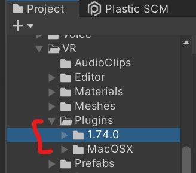

<!--_color: pink-->
<!--_backgroundColor: -->
## Kaywon art University student study
#  Oculus Quest 2 

---

### 목차

### 1.  프로그램 다운로드
 -1.1 유니티 설치
 -1.2 Oculus Quest 2 Oculus link
 -1.3 Plastic CSM 다운로드(메일)

### 2.  유니티: VR 프로젝트 생성
       -2.1 Oculus integrations 설치
       -2.2 빌드 세팅
       -2.3 VR 카메라 추가
       -2.4 VR 핸드 추가

### 3  OculusQuest 2 사용법/작동법

- 2.2 빌드 세팅
   - 2.3 VR 카메라 추가
   - 2.4 VR 핸드 추가

---

# 프로그램 다운로드

### 1.1 유니티 설치. (첫화면-유니티 허브)

1.1.1 유니티 로그인. 페이스북 
1.1.2) 유니티 학생 라이센스로 다운받기
###### 학생 라이센스 링크: https://unity.com/kr/products/unity-student
※ 학생증이 없어도 로그인 후 유니티 허브에서 오픈 가능.

######  버전: 2020.3.37f1 다운로드

---

### 1.2 Oculus(Meta) Quest 2 설치.

2.1.1) 'Oculus link' 다운로드 (오큘러스 앱 다운로드)
https://www.oculus.com/download_app/?id=1582076955407037

---

### 1.3 Plastic SCM 설치.

- 본인 메일로 발송된 Plastic SCM 초대장을 연다.
- 메일 클릭 후, 설치 버튼을 누른다.
- 설치 버튼 클릭 후, 보이는 화면에서 'cloud edition' (좌측의 아이콘) 클릭하여 설치. 
 
-  

---

### 2.  유니티 상의 VR 프로젝트와 Oculus 연결 (혁재님 담당)

#### -2.1 유니티 VR 프로젝트 열기
#### -2.2 오큘러스 앱 열기, 로그인하기
#### -2.3 오큘러스 앱과 유니티 연결 

---

# 3  OculusQuest 2 사용법/작동법

   - 2.2 빌드 세팅
   - 2.3 VR 카메라 추가
   - 2.4 VR 핸드 추가

---

---

 -페어링 코드찾기: 맨 밑 바의 우측에 주사위 모양 아이콘 클릭- settings 칸 클릭- 맨 밑 'About' 클릭- 맨 밑에 Pairing code 있음.
       영상 참고: https://www.youtube.com/watch?v=YxFbAVVaw78 

---

Index Scene으로 먼저 들어가야 
다른 index들을(다른 Scene들) 볼 수 있다.

---
# Errors
<!--_color: yellow-->
#### Case 1)

 
-해결방법: Project-Oculus-VR-Plugins 에서 1.74.0만 남겨두고 나머지 삭제.

##### 해결 후 화면: 
 : plugin 안에 2개의 파일만 존재한다.

---

