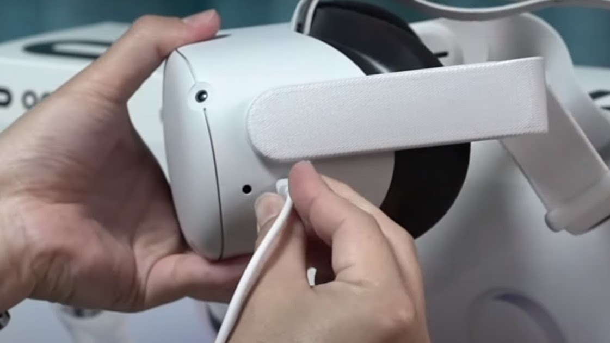

<!--_color: white-->

#  <!--fit--> Oculus Quest 2 
## Kaywon art University student study

---

### 1. 프로그램 다운로드
 - 1. 유니티 설치
 - 2. Oculus Quest 2 Oculus link
 - 3. Plastic CSM 다운로드(메일)

 - 2   유니티: VR 프로젝트 생성
- 1. Oculus integrations 설치
- 2. 빌드 세팅
- 3. VR 카메라 추가
 - 4. VR 핸드 추가

---

### 3  OculusQuest 2 사용법/작동법

 - 3.1 오큘러스 외관 설명
      -1) 헤드셋 설명
      -2) 컨트롤러 설명
 
 - 3.2 제품 사용법
     -1) 헤드셋 설명
     -2) 컨트롤러 설명

---

# 프로그램 다운로드

### 1.1 유니티 설치. _(첫화면-유니티 허브)_

1.1.1 유니티 로그인. 페이스북 
1.1.2) 유니티 학생 라이센스로 다운받기
###### 학생 라이센스 링크: https://unity.com/kr/products/unity-student
※ 학생증이 없어도 로그인 후 유니티 허브에서 오픈 가능.

######  버전: 2020.3.37f1 다운로드

---

### 1.2 Oculus(Meta) Quest 2 설치.

2.1.1) 'Oculus link' 다운로드 _(오큘러스 앱 다운로드)_
https://www.oculus.com/download_app/?id=1582076955407037

---

### 1.3 Plastic SCM 설치.

- 본인 메일로 발송된 Plastic SCM 초대장을 연다.
- 메일 클릭 후, 설치 버튼을 누른다.
- 설치 버튼 클릭 후, 보이는 화면에서 'cloud edition' (좌측의 아이콘) 클릭하여 설치. 
 
-  

---

### 2.  유니티 상의 VR 프로젝트와 Oculus 연결 (혁재님 담당)

#### -2.1 유니티 VR 프로젝트 열기
#### -2.2 오큘러스 앱 열기, 로그인하기
#### -2.3 오큘러스 앱과 유니티 연결 

---

# 3.  OculusQuest 2 사용법

 - 3.1 오큘러스 외관 설명
      -1 전체 외관 설명
      -2 헤드셋 설명
      -3 컨트롤러 설명

 - 3.2 제품 사용법
     -1 헤드셋 설명
     -2 컨트롤러 설명

---

#### 3.1 전체 구성요소

###### +이외에 컴퓨터와 헤드셋을 이어주는 USB-C타입이 있다.

---

### 3.2 오큘러스 외관 설명

###### - 구성: 헤드셋과 컨트롤러 2개로 이루어져 있음.

###### - 4시간 완충 후 2시간 사용가능.

---

#### (1) 헤드셋

- 전원/볼륨 조절 버튼 

###### - 전원버튼: 제품 우측의 버튼을 꾹 2-3초간 눌러서 켠다. (하얀 빛이 나온다.)
###### - 음량조절 버튼: 하단에 볼륨을 조절할 수 있는 버튼이 있다.

---

- **헤드셋 쓰는 방법(헤일로 스트랩)**

   - 위로 들어서 쓰고 벗는 방식  

---

-  **헤드셋 충전/ PC연결** 

: 왼쪽의 USB-c 타입 단자에 연결한다.

---

- **컨트롤러** : 

컨트롤러를 사용하여 가상의 물건들을 집거나 던질 수 있습니다.

---

 - **페어링 코드찾기**: 

홈의 UI 패널 안에서 우측에 주사위 모양 아이콘 클릭
settings 칸 클릭- 맨 밑 'About' 클릭- 맨 밑에 Pairing code 있음.
_영상 참고_ : https://www.youtube.com/watch?v=YxFbAVVaw78 

---

