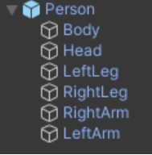
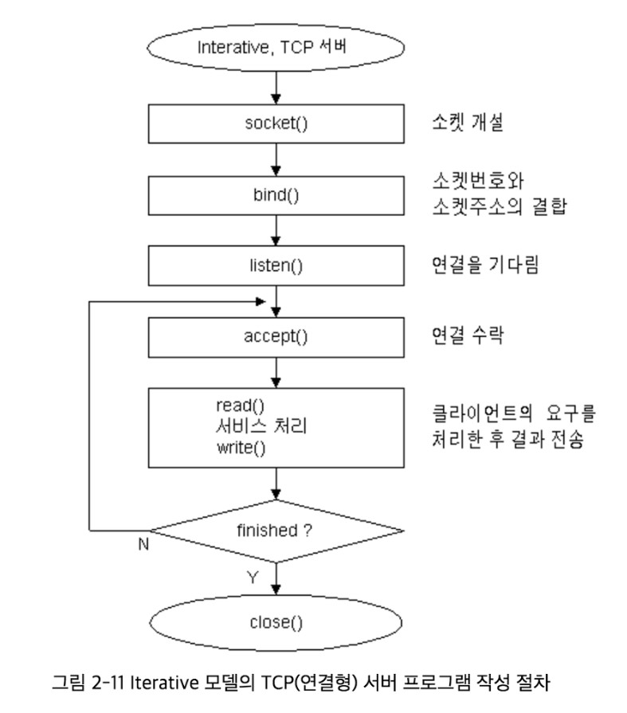

# Photon pun2 개념

## - Prefab(프리팹)이란 한 줄로 설명하자면
 
: 미리 만들어진 Object를 재활용 가능한 형태로 만들어 두는 것을 의미합니다.
 
 
- 편리한 점:  여러 Scene에서 같은 Object가 필요할 때,
Prefab으로 만들어 두면 Object를 재사용하기 편리해집니다.

    

---

### Prefab으로 만드는 법?

Hierarchy창에 있는 Person Object를 Prefab으로 저장해 두고 싶은 폴더에 drag&drop 해줍니다.

--> Object 아이콘 색상이 하늘색으로 하이라이팅 됩니다.

---
# C#

- class:
C#에서는 단일 상속만 허용. 
한 클래스는 하나의 기본 클래스에서만 구현을 상속할 수 있습니다. 그러나 한 클래스는 두 개 이상의 인터페이스를 구현할 수 있습니다. 

 

**상속(inheritance)이란, 클래스를 정의할 때 **기존 클래스** 가 가지고 있는 것들 (필드들, 메소드들 등)-을 물려받는 것을 말합니다. 
--> '기존의 것을 받는다'.

---

 ## C# 언어 함수 

인자값? : 함수에 들어가는 변수

분기문: 어느 '조건'에 따라 프로그램의 실행 내용이 분기되는 것을 말한다.

ex.) 
'if'문  --> 참 거짓 판별.
'else if'문 위의 if문이 거짓일 때 들어가도록 하는 것. 
if문 다음으로 다른 조건을 추가하는 경우 사용.

if- else if : 한가지 조건으로 분기 2가지 만들어 냄.
if- else if- else if: 두가지 조건으로 분기 4가지 만들어 냄...
if- else if- else if...- else if - else: 마지막이 else로 끝남.

여러 if 문: 각각 독립적으로 작용한다.

---

## - Q. = 과 ==의 차이?

= 는 Assignment 즉 할당연산자입니다. **우측에 있는 값을 좌측으로 넣는것**이지요.

== 두개를 표현하여 좌측데이터와 우측데이터가 **같다**는 의미를 나타냅니다.

---

## const? 개념

정의: 변수의 정의와 함께 초기화되어야 하는 상수?

1.반드시 선언 시 그 값을 할당

일반적인 멤버 변수는 선언 시 값을 할당하지 않아도 자료형에 따른 기본 값이 자동 할당. 반면 const 상수는 선언 시 반드시 그 값을 할당(초기화).

2.한번 값이 할당되면 이후 변경 불가능

3.자동으로 static

const로 선언한 상수는 자동으로 static 변수가 됩니다.

---

## compile? compiling?

- 컴파일이란?:  어떤 언어의 코드 전체를 다른 언어로 바꿔주는 과정이다.  어떤 프로그래밍 언어로 쓰여진 소스 파일을 다른 프로그래밍 언어로 바꾸어주는 **번역기**인 셈이다.

- 소스코드를 컴파일 --> 프로그램을 만들 수 있다. 

---

## Socket(소켓) 프로그래밍?

: 네트워크로 연결되어 있는  서로 다른 두 컴퓨터가 데이터를 
주고받을 수 있도록 하는 것.
 
- 내가 먼저 노드(컴퓨터)에 요청: 클라이언트
- 신호를 받아서 내려주는 역할: 서버

종류: UDP 와 TCP 2가지 종류가 있다. --> 차이?

---

## UDP vs TCP 신뢰도 up

#### UDP: 신뢰도  down
 클라이언트와 서버의 커넥션 없다. 
 메시지 하나로 왔다갔다함.
 데이터그램이 전송되는지 보장할 수 없다.  
 ->서버와 클라이언트 누구에게나 자유롭게 보낼 수 있다, 정보를 받았는지 확인이 되지 않는다. 데이터그램이 중간에 없어져도 알 수 없다.
속도가 빠르다(TCP와 다르게 흐름제어를 하지 않기 때문), 안정성 보장X
대용량 데이터를 보낼 때 사용.
데이터가 분실되더라도 우리가 취급하는데 이상이없는 경우,(영상같은거)
송수신하는 데이터의 양은 작으면서 잦은 연결이 필요한 경우에 TCP보다 훨씬 효율적이고 빠르게 동작한다.

#### TCP: 신뢰도 up

: 클라이언트가 받을 때 까지 신호를 보낸다.
바이트 스트림을 주고 받는다.
문서 전송.
속도가 느린편이다.

---

서버 만들기 절차)

         

**서버**란? : 클라이언트에게 네트워크를 통해 _정보나 서비스_를 제공하는 컴퓨터 시스템.

---

## 서버를 만들기 위한 절차 ?

1. 소켓 생성: 통신 개찰구 입구 생성. 

2. bind() : 서버의 ip주소(소켓 주소)와 포트(소켓 번호)를 소켓에 할당./ 결합.
-->나 여기서 장사할게 여기가 가게입구야.
3. listen(): 다른 컴퓨터에서 응답할 수 있도록 **대기 상태**로 만들기.
4. accept() : 어떤 클라이언트로 부터 연결 요청이 왔으면 수락해주는 함수.
5. read()write(): 두 컴퓨터가 연결되었으니 필요한 데이터를 전송하고 받는다.
6. close() : 끝날 시에 연결을 끊어준다.

---

## client 만들기 절차

1. 소켓생성
2. ()
3. connect() 연결요청
4. close() 소켓을 닫고 통신 종료하는 함수.

---

## 주소 체계와 데이터 정렬

IP vs Domain vs name server

- IP: Internet protocol의 약자

- Domain 주소: 숫자로 된 주소를 문자로 바꾸어준다.

- 네임서버: 문자로 된 주소를 숫자로 바꾸어 준다.

---

---

---