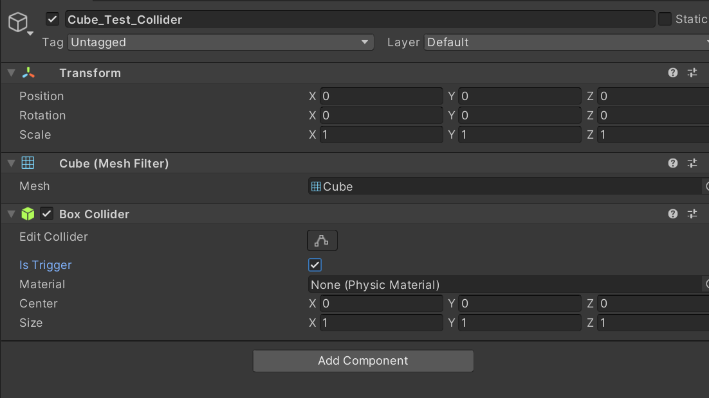

# VR project2 문서정리

---

## 1. Oculus quest 2 tracking lost guardian disabled 

- 퀘스트 다시시작
- 경계선 재설정
- 경계선 기록지우기
- 카메라청소
- 조명 및 추적설정 조정 - 기본적으로 추적 주파수는 자동설정. 지역에서 사용하는 주파수에따라 변경.

https://uploadvr.com/tracking-lost-quest-2/

---

전세계 AC 전압 및 주파수 목록
한국 220V 60Hz

https://uploadvr.com/tracking-lost-quest-2/

---

- 공간의 큰 변화
- 조명의 큰 변화
- 안전보호 겨예를 그릴때 의도한 플레이 공간의 중심에 최대한 가까이 섭니다.
- 경계를 그릴때 방 여기저기를 바라봅니다.
- 직사광선을 피합니다.

https://store.facebook.com/ko-kr/help/quest/articles/fix-a-problem/troubleshoot-apps-and-features/troubleshoot-guardian-quest-2-quest-rift-s/

---

- 스페이스 센스 - 플레이 영역안에 사람이나 동물이 들어왔을시 윤곽 표현

https://store.facebook.com/ko-kr/help/quest/articles/in-vr-experiences/oculus-features/oculus-guardian/

---
## 2. Oculus Quest2 Tracking Lost Error

- 오큘러스 퀘스트 인식 원리

  - 오큘러스 퀘스트2인 경우, 외부 추적 장치를 사용함 - 비콘이 필요없는 독립형 VR 헤드셋
  - 4개의 작은 카메라를 사용하며, IMU(관성 측정 장치)를 사용해 자이로스코프, 가속도계 및 전자 나침반을 사용해 위치의 변화 감지
  - 컴퓨터 비전과 IMU의 데이터를 사용해 주변 환경의 3D지도를 실시간 생성해 3D공간에서 자신의 위치 감지
 
*비콘(beacon) 또는 비컨 : 특정 위치의 정보를 전달하기 위해 사용되는 장치.  흔한 예로는 장애물 주변을 항해하거나 항구로 들어오게끔 하기 위해 사용할 수 있는
지정된 지점에 주의를 주는 등대나 나라에 병란이나 사변이 있을 때 신호로 올리던 불인 봉수가 있다
**자이로스코프 : 항공기·선박 등의 평형 상태를 측정하는 데 사용하는 기구

https://360rumors.com/oculus-quest-2-tracking-lost/

---

### 주의사항
- 시야를 가리는 것이 있거나, 주변 환경이 너무 빨리 바뀌면 추적 실패
- 헤드셋을 조정하는 동안 손이 카메라를 부분적으로 차단하는 경우 또는 하나 이상의 카메라를 차단하는 경우
- 헤드셋의 전원을 킨 상태에서 주변의 움직임이 많은 경우
- 앉은 상태에서 서 있는 상태로 이동할 때, 헤드셋의 전원을 켠 상태로 많이 움직이면 추적 실패
- 움직이는 환경에 있을 때 (예시: 배, 움직이는 방)
- 환경이 너무 밝거나 너무 어두울 때, 방이 어둡거나 밝은 햇빛 아래에서 퀘스트2를 사용할 때, 카메라가 조명에 반응하지 못함.
- 스크린과 모니터, 화면과 모니터는 밝기를 빠르게 변경하거나 매우 빠른 속도로 깜빡일 수 있기 때문에 혼동을 줌

---

### 추적 손실 오류 해결법
1. 헤드셋 확인 : 카메라를 막고 있는 게 없는 지 확인 / 많이 움직일 경우 방향을 잡을 때 움직임 최소화
2. 컨트롤러를 헤드셋 가까이에 두고 전면에 두기 / 손 추적을 즉시 사용하지 않기 
3. 조명이 적절한 방에 있는 확인 / TV나 컴퓨터 화면을 향하고 있으면 멀리 하거나 화면 끄기 / 실내로 이동하기
4. 보호자 기록 삭제
5. 추적을 다시 켜기 
6. 백업 파일 및 공장 초기화 

---

7. 추적을 방해하는 물건이 많은 경우(전원 케이블, 가전 제품, 형광등, 다양한 무선장치 등), 평평한 표면 또는 물건이 없는 방에서 시도
8. 핸드 트래킹 끄기(일부 경우 발생하는 소프트웨어 릴리스에서 추적 문제)
9. 헤드셋이 절전모드 상태일 때 추적을 시작하면 에러 발생 확률이 높음. 평소에는 대기모드보다는 헤드셋을 끄는 것을 추천
10. 추적 빈도 변경(주파수)
11. 헤드셋과 컨트롤러를 바닥에 놓고 1분동안 켜놓기(방을 안정적으로 맵핑하는 방법)
12. 컨트롤러 배터리 교체
13. 오큘러스 장치 업데이트

https://smartglasseshub.com/quest2-tracking-lost/

---

## 3. 트래킹 실패 시 추적 주파수 변경 이유

가정에서 사용하는 교류(AC)전기의 전압과 주파수가 국가에 따라 다르다.
일반적으로 120볼트 AC 또는 240 볼트 AC가 사용된다.
대부분 국가에서는 AC주파수로 50Hz(초당 50Hz 또는 50사이클) 사용한다.
 
미국의 표준은 120V 및 60Hz AC전기 
남한 표준은 220v 60Hz
 Hz : 초당 주기 , 추적 주파수 : 헤드셋이 추적 목적으로 위치를 이전 것과 비교하는 빈도

 https://www.school-for-champions.com/science/ac_world_volt_freq_list.htm#.YudwZnZBzZR
https://www.reddit.com/r/OculusQuest/comments/g39xjo/what_does_tracking_frequency_do/

---

헤드셋 추적주파수가 50Hz일 때, 초당 50번씩 위치를 확인하라 지시함. 1초당 50번 헤드셋은 사용자의 위치와 향하고 있는 방향의 변화에 적응함.
 
만약 헤드셋 추적주파수를 1Hz로 설정할 수 있다면, 헤드셋은 1초당 한번만 추적할 수 있다는 뜻이다. 
따라서 움직이거나 반응하는 과정에서 헤드셋은 1초에 한번만 업데이트를 하기 때문에 지연이 생긴다.
 
전력 시스템의 주파수가 50Hz일 때는 방의 전등이 1초당 50번 켜지고 꺼진다는 뜻이다.
헤드셋의 추적 주파수를 50Hz라고 설정했을 때는 Hz가 같기 때문에 올바르게 보인다. 하지만 전력시스템이 60hz일 때,
헤드셋을 50hz로 설정하면 속도를 따라갈 수 없어 지연되어 보이거나 추적을 실패하게 된다.
 
---

- 결론: 국가마다 전력 시스템이 다르고, 추적 주파수를 다르게 설정하면 추적 실패할 수 있다. 한국은 전력 시스템이 60Hz인데,

헤드셋의 추적 주파수를 50Hz로 할 경우, 전등에서 나오는 빈도(1초당 60번)와 헤드셋 추적 빈도(1초당 50번)가 다르기 때문에

지연이 생겨 추적에 실패하게 된다. 추적 주파수는 국가의 전력 시스템보다 같거나 높은 Hz로 설정할 것.

---

## 4. 오큘러스 퀘스트2 공장 초기화 방법

- 오큘러스 퀘스트2 VR장비 초기화

1. VR 장비 전원 끄기(전원 버튼을 꾹 누른 후 종료 클릭)
2. 전원을 끈 상태에서 아래의 화면이 나올 때까지 전원 버튼과 볼륨 
아래(-) 버튼 꾹 누르기

---

---

## 5. URP

https://rainyrizzle.github.io/kr/AdvancedManual/AD_URP.html
  
https://docs.unity3d.com/Packages/com.unity.render-pipelines.universal@7.1/manual/upgrading-your-shaders.html

---

## 6. Photon Scene Change

https://www.youtube.com/watch?v=4f_VGLtdQ-I

https://www.youtube.com/watch?v=51W7tnnvzbs

RPC : Remote Procedure Call : 원격 프로시저 콜

---

## 7. OVR Manager function

https://argos.vu/a-detailed-look-at-oculus-utilities-for-unity/

---

## 8. 유니티 오류모음   

- 씬 이동 시, DontDestroyed에 New gameobject 가 두 개 생겼을 때,

OVRHandprefab - OVR Hand - Pointer Pose Root가 None일 때 
→ Root안에 Transform 추가.

---

## 9. 사이드퀘스트 오류모음   

- 이전 버전을 안 지우고 설치하는 경우 :

: 원래 있던 유니티 앱을 폴더에서 삭제하고 다시 설치

---

## 10. Object Collider 잡기 기능 + Photon view   

### - Cube 또는 유니티에서 제공하는 단순 형태의 오브젝트일 경우.
 

1). Hierarchy창에 우클릭 후 Create Empty하여 빈 GameObject 생성.

(원하는 이름으로 변경, 예제 = TestName)

    참고) Create Empty해서 만든 모든 오브젝트는 Position X,Y,Z를 0,0,0으로 초기화하기.

---
2). 해당 오브젝트(TestName) 안에 Touch hand Grab Interactable, Rigidbody, Grabbable, Physics Grabbable, Respawn On Drop 스크립트 추가

---

3). TestName(부모)에 Cube_Test(자식), Cube_Test_Collider(자식) 추가.

- Cube_Test(자식) : 
모델링 된 오브젝트.
- Cube_Test_Collider : 
Create Empty 하여 제작한 빈 오브젝트. (물건이름_Collider)

---

4). Cube_Test_Collider에 Mesh Filter, Box Collider 추가.

※ Box Collider의 Is Trigger 꼭 체크하기!

 

---

5). TestName(부모)에서 위 사진과 동일하게 설정 

- Touch Hand Grab Interactable - Pointable Element에 
TestName(자기 자신)을 드래그 드롭.
bounds collider에 Cube_Test_Collider(자식)를 드래그 드롭.

- Grabbable - Transfer On Second Selection 체크.
- Physics Grabbable - Grabbable과 Rigidbody에 TestName(자기 자신)을 드래그 드롭.
- Respawn On Drop - 0.1로 설정. (만약 Rigidbody에 Use Gravity 꺼져있다면 꼭 체크하기.)

---

5). 

 

---

6). Cube_Test에 Mesh Collider추가.

- 오브젝트에 'Box Collider'가 있다면 지우기.
- Convex체크하기

*Cube_Test(자식) : 잡을 수 있는 부위.
*Cube_Test_Collider : 잡을 수 있는 범위.

 

---

7). TestName에서 Touch Hand Grab Interactable 스크립트 안 'Colliders'에 'Cube_Test'를 드래그 드랍.
 
 

---

### - 제작 모델링 오브젝트일 경우
 
1). Hierarchy창에 우클릭 후 Create Empty하여 빈 GameObject 생성.(원하는 이름으로 변경, 예제 = TestHorse)   

2). 해당 오브젝트(TestHorse) 안에 Touch hand Grab Interactable, Rigidbody, Grabbable, Physics Grabbable, Respawn On Drop 스크립트 추가.   

3). TestHorse(부모)에 Chesshorse(자식), Chesshorse_Collider(자식) 추가.

---

4).

-Chesshorse_Collider에 Mesh Filter
와 Box Collider 추가.
※ Mesh는 꼭 기본 Cube로 설정하기.
    
-Box Collider은 잡을 수 있는 범위라서 영역을 적절하게 조절하기.
Is Trigger 체크하기. 

**Collider 주의사항 참고

---

5). ->TestHorse(부모)에서 위 사진과 동일하게 설정.

#### -Touch Hand Grab Interactable 
- Pointable Element에 TestHorse(자기 자신)을 드래그 드롭,
boundscollider에 Chesshore_Collidr(자식)를 드래그드롭. 
#### -Grabbable 
- Transfer On Second Selection 체크
#### -Physics Grabbable 
- Grabbable과 Rigidbody에 TestHorse(자기 자신)을 드래그 드롭
#### -Respawn On Drop - 0.1로 설정 (만약 Rigidbody에 Use Gravity 꺼져있다면 꼭 체크하기)

---

5). 

 

---

6). 만약 적용할 모델링 조각이 
한 개일 때, 

-Chesshorse(모델링 된 오브젝트)에 Mesh Collider 추가하기.
(Convex 체크).

(적용할 모델링이 한 개 이상일 때는 아래 설명을 참고)

 

---

7-1). 만약 적용할 모델링 조각이 한 개 이상일 때, 
- 빈 오브젝트 생성 후, 'KnightCollider'(원하는 이름:부모)로 변경하기.

 

- KnightCollider(부모)안에 ConvexHullPart(자식) 생성하기. 
*자식은 모델링 파트 수만큼 생성

---

7-2). 'ConvexHullPart'
(자식 : 모델링 된 오브젝트 조각)에 'Mesh Collider' 생성
(Mesh는 모델링과 맞게 설정)

 

---

7-2).  

---

7-3). TestHorse(최상위 부모)의 

'Touch Hand Grab Interactable' - 'Colliders'에, 

'Hierarchy'창에 있는 ConvexHullPart를 하나씩 드래그 드롭.
 
※ Collider 주의사항 참고

 

---

### Photon으로 오브젝트 동기화하는 방법

#### 1). 잡는 기능을 가진 오브젝트를 동기화시킬 때

: 잡을 수 있는 범위를 가진 오브젝트, 즉 BoxCollider를 가지고 있는 Obeject 안에
Photon View, Photon Transform View, Pun OVR Grabbable 스크립트 추가

---

### - 체크 할 것

- Photon View : 
-Ownership Transfer - TrakeOver
-Synchronization - Unreliable On Change.
-Observable Search - Manual (이때 Observable Components는 
자기 자신 (해당 스크립트를 가지고 있는 오브젝트)으로 하기

→ 드래그 드랍 시 Photon Transform View 스크립트 자동 생성

- Photon Transform View :
-Position - Check, Rotation - Check, Use Local - Uncheck
 
- Pun OVR Grabbable :
-Allow Offhand Grab - Check

---

- Rigidbody 추가(설정 Interpoliate로 변경), boxcollider 추가

---

### - Collider 주의사항

-Bounds Collider - 물체를 잡기 위한 공간. [ Is Trigger (on) ]

*여유 공간 *Is Trigger를 켜야 물체가 밀리지 않음.
 
-Colliders - 실제로 물체가 잡히는 공간. [ Is Trigger (off) ]
*Bounds Collider 보다 작은 공간 *Is Trigger가 꺼져 있어야 물체를 통과 하지 않고 잡힘.

---

## 11. 핸드 트래킹 관련
OVRCamera의 손 추적 지원을 "컨트롤러 및 손"으로 설정하여 내 앱에서 손 추적 및 컨트롤러(동시에 아님)와 함께 양손을 사용하고 있습니다.
내가 원하는 것은 손 추적과 컨트롤러 사이의 전환을 감지하는 것이지만 런타임에 손에서 컨트롤러로 변경할 때 OVRHand의 IsTracked 및 HandConfidence가 마지막 값을 유지하고 업데이트하지 않는 것 같습니다. 그래서 종종 둘 중 하나 또는 둘 다 여전히 유지됩니다 활성 손의 값(IsTracked = true 및 HandConfidence = TrackingConfidence.High)이며 변경을 감지하는 데 사용할 수 없습니다. 손짓으로 앱에서 Oculus 홈으로 돌아간 다음 홈에서 컨트롤러를 켜고 앱으로 돌아가면 확인할 수 있습니다. (그러나 이 문제는 컨트롤러를 터치하여 앱에서 컨트롤러를 활성화할 때도 발생하지만, 컨트롤러를 터치하면 값이 변경될 수 있으므로 IsTracked = false이고 HandConfidence가 낮음이 표시되는 경우도 있습니다.)
OVRHand의 SkinnedMeshRenderer.enabled 값을 확인하여 감지할 수 있습니다. 그러나 손 추적을 사용하지 않을 때는 IsTracked가 최소한 false여야 한다고 생각합니다.
https://forums.oculusvr.com/t5/Unity-VR-Development/IsTracked-is-true-and-HandConfidence-is-High-when-hand

---

## 12. 손 위치
 
-검정 오른손 = Player > TrackingSpace > RightHandAnchor
 
-검정 왼손 = Player > TrackingSpace > LeftHandAnchor
   
- 유니티 재생 시 생기는 오브젝트 ↓
  
-로컬아바타 왼손 =Joint LeftHandWrist(?)

-로컬아바타 오른손 = Joint RightHandWrist(?)
 
- 스크립트 예측 : OVR Hand, Hand, OVRManager, OVRCameraRig
OVRCameraRig 안의 UpdateAnchors

---

## 13. 유니티 총알 충돌 폭발 이펙트

- Unity 2D [Tag 사용]  
https://astoration.gitbooks.io/sihs-shootinggame/content/8c77c_cc28_-_cd1d_c54c_c5d0_b9de_c73c_ba74_d3ed_bc.html
https://malbongcode.tistory.com/25   
 
- Unity 3D [Tag 사용]  
https://koreanfoodie.me/632
-Unity 3D [Raycast 충돌 감지]
https://ansohxxn.github.io/unity%20lesson%203/ch2-3/

---

- Raycast 관련 구체적인 설명
https://kukuta.tistory.com/391
 
- Raycast 쉬운 설명
https://novlog.tistory.com/55
 
- Raycast를 활용한 총알 피격 감지
https://onecoke.tistory.com/entry/%EC%B4%9D%EC%95%8C-%ED%94%BC%EA%B2%A9-%ED%8C%8C%ED%8B%B0%ED%81%B4-%EB%B0%9C%EC%83%9D%EC%8B%9C%ED%82%A4%EA%B8%B0-Raycast-RaycastHit

- 폭발 효과 최적화 참고 링크
https://wergia.tistory.com/203

---

## 12. Plastic SCM 새 조직 추가 / Unity 연결
 

#### 1. Unity ID 페이지에서 "Organizations"으로 이동
https://id.unity.com/en/organizations

 

- Add new 버튼 클릭하여 새로 만들기

---

- 조직 이름(Organization Name)과 분야(Industry) 선택 후 생성(Create) 버튼 클릭.

---

#### 2. 유니티 대쉬보드에서  새 프로젝트 생성

 

-Create Projcet 클릭하여 새 프로젝트 생성

https://dashboard.unity3d.com/organizations/14568800501890/settings/projects

---

- 프로젝트 이름 입력, 질문에 대한 답변은 'NO' 입력 후,
 'Create Projcet' 클릭

---

#### 3. Plastic SCM과 Unity 연결을 위한 결제(무료체험)
 

- 생성 완료 후, 왼쪽 메뉴바에 'DevOps'를 클릭하여 이동
https://dashboard.unity3d.com/organizations/14568800501890/plastic-scm/about

---

- 'DevOps' - 'Plastic Scm Cloud Edition' - 'Overview'로 이동 후 'Try for free' 클릭- 

---

- Continue to purchase → Next Step

