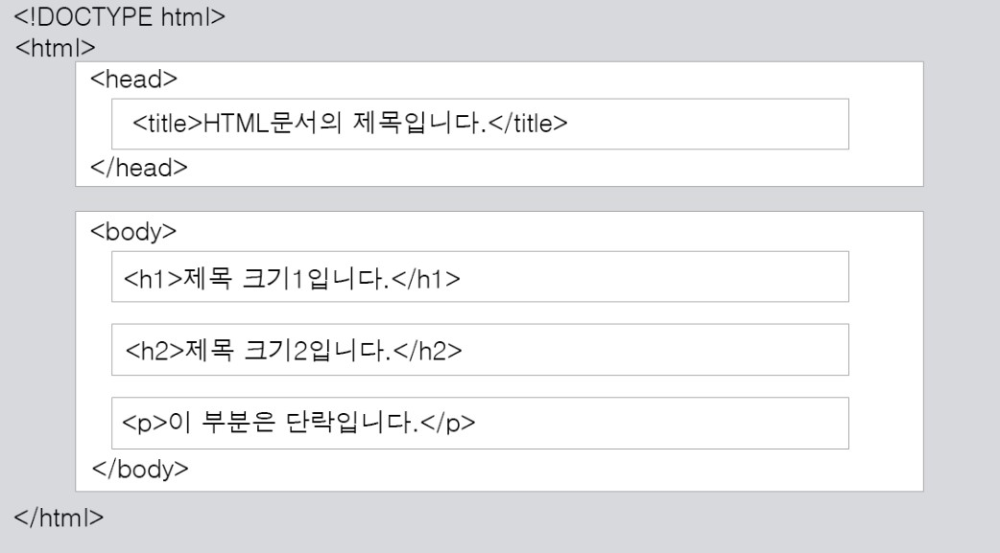
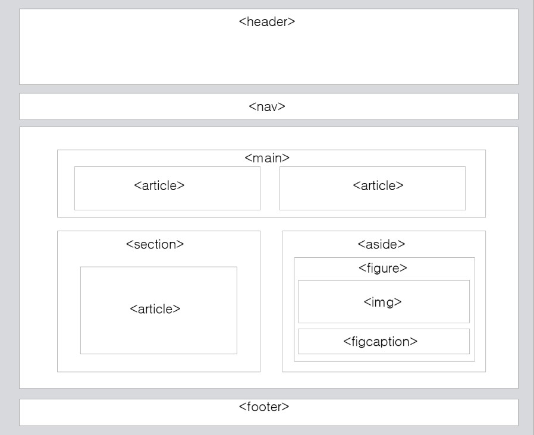

<!--_color: pink-->
# <!--fit--> STUDY HTML
#### Every SAT.

---

- HTML 의 구조

---

- '!DOCTYPE html' : 현재 문서가 **HTML5** 문서임을 명시합니다.

- _'html' : HTML 문서의 루트(root) 요소를 정의합니다.???_

- 'head' : HTML 문서의 메타데이터(metadata)를 정의합니다.
: 메타데이터(metadata)란 HTML 문서에 대한 정보(data)로 웹 브라우저에는 직접적으로 표현되지 않는 정보를 의미합니다.

---

ex) 속성으로 'charset= utf-8'이라고 표현한 것은, 브라우저에게 한글 인코딩을 utf-8으로 설정한 것--> 한글이 깨지지 않음.
 
### - 이러한 메타데이터는 'title', 'style', 'meta', 'link', 'script', 'base' 태그 등을 이용하여 표현할 수 있습니다.

---

### - 'title' : HTML 문서의 제목(title)을 정의하며, 다음과 같은 용도로 사용됩니다.

- 웹 브라우저의 툴바(toolbar)에 표시됩니다.

- 웹 브라우저의 즐겨찾기(favorites)에 추가할 때 즐겨찾기의 제목이 됩니다.

- 검색 엔진의 결과 페이지에 제목으로 표시됩니다.

### - 'body' : 웹 브라우저를 통해 **보이는** 내용(content) 부분입니다.

---

# HTML 레이아웃

### - 3가지 방법

  - 1. div 요소를 이용한 레이아웃
  - 2. HTML5 레이아웃
  - 3. table 요소를 이용한 레이아웃 

---

HTML5 레이아웃

---

- header:	HTML 문서나 섹션(section) 부분에 대한 헤더(header)를 정의함.

- nav:	HTML 문서의 탐색 링크를 정의함.

- section:	HTML 문서에서 섹션(section) 부분을 정의함.

- article:	HTML 문서에서 독립적인 하나의 글(article) 부분을 정의함.

- aside:	HTML 문서에서 페이지 부분 이외의 콘텐츠(content)를 정의함. 

- footer:	HTML 문서나 섹션(section) 부분에 대한 푸터(footer)를 정의함.

---

---

---

---

# 웹 브라우저가 작동하는 방법

---

---

---

---

---

---

---

---