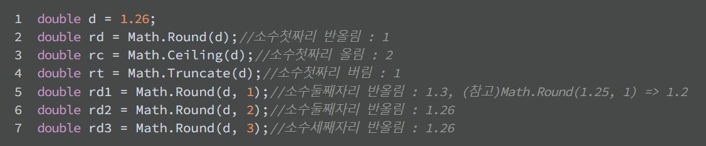
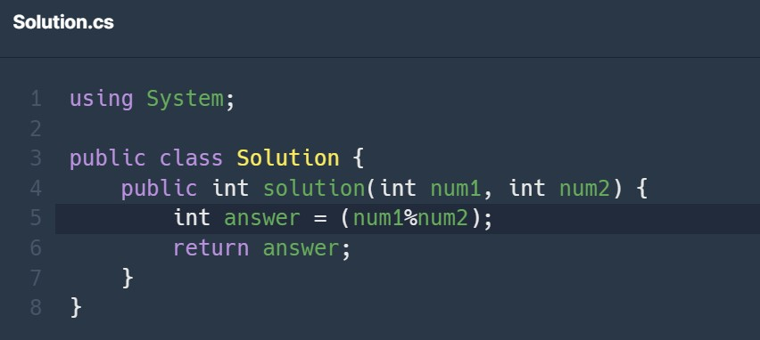

<!--_color: orange-->

# _<!--fit-->C# TEST REVIEW!_

by. programers

---

# 코딩 테스트 활용법 by. 요기요개발자

## 1. 습관 만들기
- 하루에 딱 한 문제만 푼다.
- 대신에 매일매일 한다.
- 모르는 문제가 나오면 고민을 해보고, 1시간이 넘어간다 싶으면 답을 본다.
- 답을 보고 내 코드를 비교해보고, 회고를 해본다.

---

## 2. 유형분석 & 유형별 풀이

- 1번이 익숙해지면 쉬운 유형 문제부터 진행한다.
- 답이 맞고 틀리기에 집착한다기 보다는 어떤 유형이 있는지 파악한다.

---

## 3. 난이도 올리기

- 쉬운 유형에 어느정도 익숙해지면 조금씩 난이도를 올린다.

4. 매일매일 꾸준히 계속 풀기

- 1~4의 과정을 매일매일 반복하면서 조금씩 꾸준히 푼다.

5. 매일 푸는 문제들을 다른 사람들의 코드와 비교해서 어떤 점을 개선할 수 있을지 스스로 회고해 본다.

---

- ## Action Items

1. 코딩 테스트 사이트 1개를 정하고 오늘 바로 내 수준에 맞는 혹은 더 낮은 '1'문제를 푼다. 이것을 매일매일 실천해 본다.

2. 자체 코딩 테스트를 치르고, 공개되어 있는 회사들의 문제들을 보고 어떤 유형이 나오는지 파악해본다.

3. 내가 푼 문제를 글로 남기고, **개선점**을 회고해 본다.

---

# <!--fit--> 문제풀이

---

- ## 소수점 나눗셈 (반올림) 문제 회고록
내가 푼 문제 풀이
``` c#
using System;

public class Soulution {
    public double solution (double num1, double num2) {

        double answer = Math.Truncate (num1/num2*1000);
        return answer;
    }
}
```
변수 int 대신에 double을 넣어준다
: int를 변수로 넣으면 정수 값만 나오기 때문에
Math.Round 를 넣어서 소수점 뒷자리를 없애준다. 

자세한 내용 참고 : https://cosmosproject.tistory.com/529

---

## 반올림/ 올림/ 내림? 

-Math.Round(인자값): 반올림 : 소수점 반올림??

-Math.Ceiling(인자값): 올림 : 소수점을 올림한 수

-Math.Floor(인자값): 내림 : 소수점 뒤의 숫자를 모두 지움.



---

## 나머지 구하기

-숫자와 숫자 사이에 '%' 를 사용.--> 몫만 알 수 있음.




참조링크: https://learn.microsoft.com/ko-kr/dotnet/csharp/language-reference/operators/arithmetic-operators

---

## 분수의 덧셈

Q. 분수의 분모, 분자의 숫자 각각 나누기 형식으로 해서 더해준다면 분수 형식으로 답이 나오지 않을까?

NO! --> '소수점' 형식으로 답이 나온다.('5/6'으로 나오지 않음.)
HOW? ---> 그럼 어떻게 풀어?
최소공배수로 분모를 맞추어 준 다음, 분자에 해당 값만큼 곱해주고 더해준다.

---

# 첨자값 INDEX

```c#
int[] reading = new int[30]{4,9,1,0,21,12,...}
```

: '[ ]'은 자료의 크기 예) int[6] --> int 변수의 '크기'가 5까지 들어감. 
(ex. int[1],int[2],int[3],int[4],int[5])

※ 첨자값은 항상 '0'부터 시작한다. ex. 위의 식을 보면 int[1]은 '9'이다

<br>
참고자료: https://blog.hexabrain.net/136

---


- 해당 참고 답안

```c#
using System;

public class Solution {
    public int[] solution(int numer1, int denom1, int numer2, int denom2) {
        int new_denom = denom1 * denom2;
        int new_numer = numer1 * denom2 + numer2 * denom1;
        int gcd = GCD(new_numer, new_denom);

        int[] answer = new int[2];
        answer[0] = new_numer / gcd;
        answer[1] = new_denom / gcd;
        return answer;
    }

    // 최대공약수를 구하는 함수
    private int GCD(int a, int b) {
        if (b == 0) {
            return a;
        }
        return GCD(b, a % b);
    }
}
```
---

### 위의 식 해설

A: '재귀문'을 활용.

1. '최대 공약수'를 구하여 분모를 맞춰준다.
2. 각 분자에 최소공배수 만큼 곱해준다.
3. 분자만 따로 더해준다.

---

## public, protected, private, internal의 차이점

- public: 모든 외부 객체로부터 접근을 허용한다.
- protected: 상속되는 파생클래스에서만 접근할 수 있다.(private 와 public의 중간.)
- private: 해당 클래스 내에서만 사용. 외부 또는 파생클래스에서 접근 불가.
- internal: 동일 어셈블리(.NET Assembly)내에 있는 다른 클래스들에서 접근이 가능하다.
- protected internal: 동일 프로그램 내에서 혹은 파생 클래서에서 클래스 멤버 이용가능.

자료 출처: https://durubiz.tistory.com/entry/C-%EC%A0%91%EA%B7%BC-%EC%A0%9C%ED%95%9C%EC%9E%90-%EC%A0%91%EA%B7%BC%EC%9E%90-%EA%B4%80%EB%A0%A8-private-public-protected


---

## 배열의 평균값

- 배열 관련 메서드

Name.Max() : 배열 요소 중 최대값 반환.

Name.Min() : 배열 요소 중 최소값 반환.

Name.Sum() : 배열 요소의 합계 반환.


참조링크: https://homzzang.com/b/cs-20


---

- ##  class의 특징?
모든 클래스는 **복합 데이터** 형식이다. 
복합데이터 형식은 참조 형식이다.
<br>
```c#
Cat kitty = new cat();
```
<br>
kitty는 'null'을 가진다.
kitty 자체에 메모리가 할당되는 것이 아니라, 참조로서 객체가 있는 곳을 가리킨다.

---

## - 'new' : 연산자

역할: 생성자를 호출해서 객체를 생성.
연산자(new)와 생성자는 바늘과 실 같은 존재?

독립적으로 사용이 가능하고 함수 호출 가능. 

new와 class의 와의 차이는 무엇일까?

※ 연산자 new가 인스턴스를 생성하는 것이지 생성자가 인스턴스를 생성하는 것이 아니다.
- cat: 생성자 Constructor 
<br>
출처: https://nomad-programmer.tistory.com/152

---
# 인스턴스화 ( new 연산자 )

- 객체 만드는 방법? --> 인스턴스화

:클래스로부터 '객체'를 만드는 과정.
어떤 클래스로부터 만들어진 객체.


---

- 공부하면서 궁금한 것들 

null?

string?

cat?

void? public void?

---

- ### class란?

객체를 정의해 놓은 것 or 객체를 생성하기 위한 설계도.
교수님: 함수와 변수가 들어있는 값??

*객체?: 클래스에 정의된 내용이 메모리에 생성된 것.

인스턴스화: 클래스로부터 객체를 만드는 과정.

---

새 인스턴스 유형 만들기--> 왜 만드는데?


---

## 암시적 형식 지역 변수..Var..(implicitly typed local variable)

: 데이터 타입을 개발자가 아닌 컴파일러가 결정하게 만드는 키워드. 

할당된 오른쪽 값을 확인하여 컴파일러에 의해 왼쪽 변수 타입을 결정하게 된다. --> 컴파일러에게 변수의 타입을 명시적으로 알려주지 않아도 개발자를 대신하여 올바른 타입을 추론해줌.

※ 개발자가 올바른 반환타입을 알지 못해 올바르지 못한 타입을 명시적으로 지정하여 사용되는 경우를 방지한다.

but, 내장 숫자 타입(int,float,double..등등)은 다양하게 변화가 가능하다.(int<>double). 이들은 각각의 정밀도가 다르기 때문에 가독성과 정밀도에 있어서 오류가 발생할 수 있다.

---

### 참조: https://huiyu.tistory.com/entry/effective-C-%EC%A7%80%EC%97%AD%EB%B3%80%EC%88%98-%EC%84%A0%EC%96%B8%EC%9D%80-var%EB%A5%BC-%EC%82%AC%EC%9A%A9var-%EA%B8%B0%EC%B4%88

---

# 명시적 변환 int(double)

참조: https://learn.microsoft.com/ko-kr/dotnet/csharp/programming-guide/types/casting-and-type-conversions

---

## 오름차순/ 내림차순

- 오름차순
Array.Sort(arrName);

- 내림차순

1. Array.Sort(arrName);
2. Array.Reverse(arrName);
--> 먼저 오름차순 정렬 후 뒤집기.

---

# 문자열 Sting

: 문자들의 집합.

문자 1개: char형 변수에 저장.

---

# NULL 문자? ('\O')

이 문자의 끝을 알리기 위해 사용된다.

예) I like cat ---> 문자의 수: 8개 /실제 필요한 공간의 수: 9개
char형 배열에 문자를 저장하고 싶다면 반드시 문자의 개수+1에 해당하는 크기를 할당해 놓아야 한다.

cat의 t가 마지막 글자라는 것은 나만 알뿐이고 코드는 알 수가 없다.

---

## 관계연산자

: 두 개의 피 연산자의 값을 비교하여 그 결과를 참 or 거짓으로 나타내는 연산자.

두 연산자의 값이 같다: ==
두 연산자의 값이 다르다: !=
크거나 작다: >,<
크거나 같다, 작거나 같다: >=,<=

---

## 논리 연산자

: 주어진 논리식을 판단하여, 참, 거짓 판별.

&&: 

---

### bool 자료형: true/ false로 구성되어 있음. 예/아니오--> 논리값.

예/아니오 판단할 때 사용.

- C언어--> 값, 논리값 둘 다 사용 (int=0 죽음 int =1 살아있음 이렇게 표현가능.)
- C# 언어--> 논리값만 별개로 취급.

왜? :게임에서 캐릭터가 죽어있거나 살아있거나 표현하려면
int를 선언해서 0이면 죽고 1이면 살고 표현하는 것 보다, 직관적임.

```C
bool char_dead= true;
if (char_dead==true) game_restart();
```
캐릭터의 상태가 죽었으면 게임을 다시 시작한다는 것이 눈에 보인다.
이렇게 직관적으로 표현 가능!

---
# Loop 문 

여러 건의 데이터를 순차적으로 처리할 때 사용되는 구문.
필요한 경우: 
1. 리스트 박스에서 다중 선택된 값을 다른 곳에 저장할 때.
2. 저장된 데이터를 화면에 하나씩 보여줄 때

4가지로 이루어져 있다.
- for
- while 
- do while
- foreach


---


---


---


---


---


---

C 언어 정리

## 함수란? : 일정한 기능을 수행하는 코드단위를 의미.

머리와 몸통으로 구성.

머리: 함수의 이름과 필요한 데이터 구성.
몸통: 중괄호로 이루어지며 실행할 일들을 구성.

---

# <studio.h>?
```c
# include <studio.h>
```

studio--> 표준 입출력 (standard input output)

 # print.f 함수 : 문자열 출력함수

 print.f("문자열")

?문자열? 과 문자?

문자: a
문자열: apple

---

# 제어문자

- 줄바꿈: \n: 다음 줄로 이동 new line
- \r 맨 앞으로 이동 carrige return
- \t 출력 위치를 다음 탭 위치로 옮긴다.
- \b: 앞 글자 바꾸기, 한 칸 왼쪽으로 이동 backspace
- \a 벨소리 내기 alert

---

# 출력

print.f 정수나 실수 문자열 모두 출력이 가능하다.

문자열: print.f("안녕");
정수: print.f("%d, 10");
실수: print.f("%lf,3.5");
수식: print.f("%d, 10+20");


---

# 소수점 자릿수 지정

%lf --> 소수점 이하 6자리 까지 출력됨.

소수점 반올림?
'%' .2 'lf' 사이에 원하는 자릿수 지정하면, 반올림 처리되어 출력됨.

---

# 내 주제에 포인터...봐버렸다..

Pointer!

: 주소를 저장하는 변수로 선언 후에 사용한다.(일반변수와 마찬가지.)

address: 주소. 주소값.
메모리 상 데이터를 식별할 수 있는 값.


