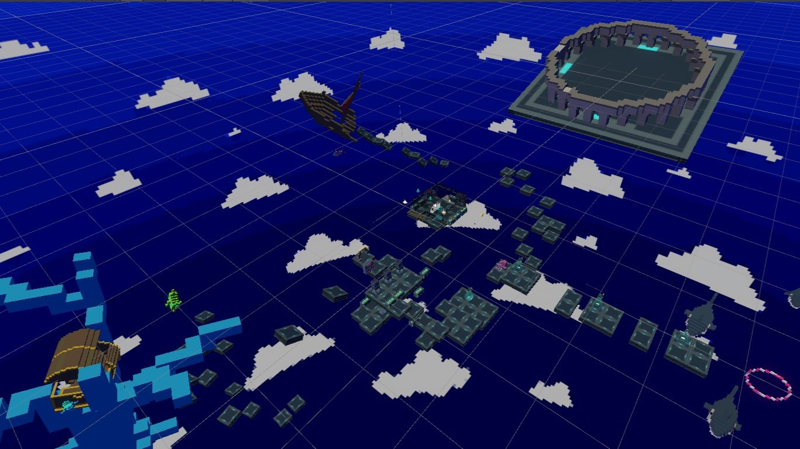
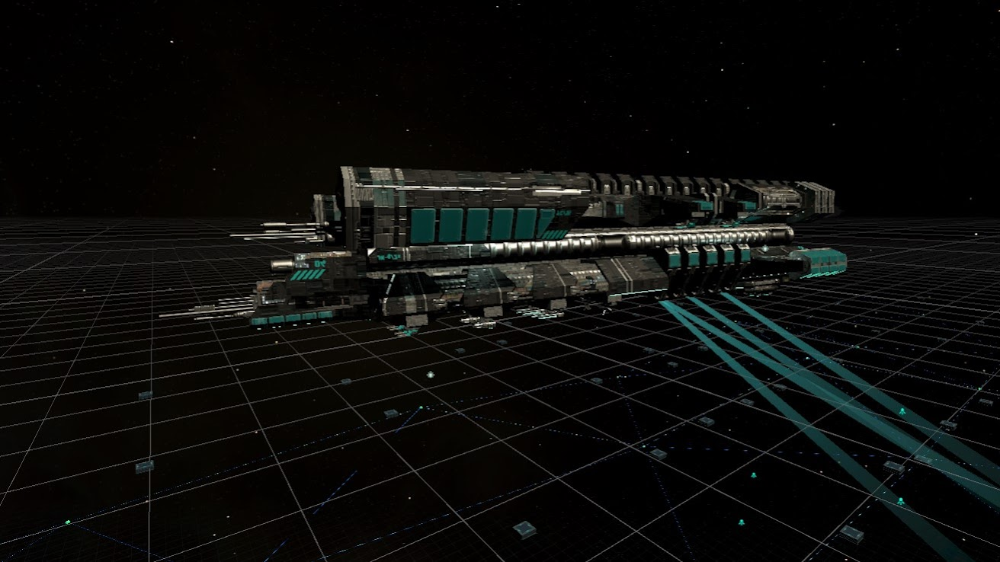
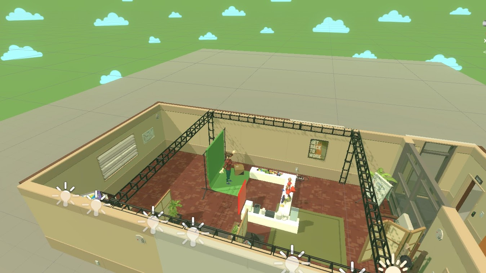
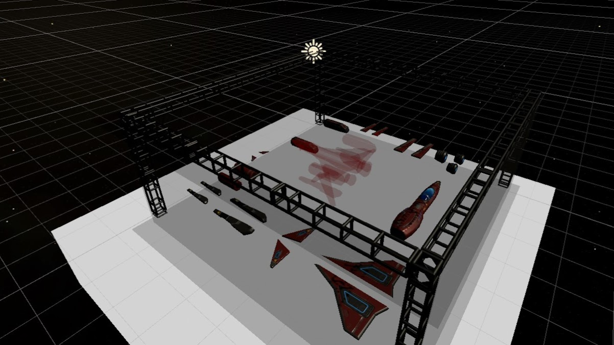

<!--_color: pink-->
### Unity
# Project_VR_shared_space

---

## Index <!--_color: pink-->
#### Scene 정리
- ABCD scenes table 

---
<!--_color: pink-->
# ABCD Scenes
---

File_name| Screenshoot | Explanation
---------|:-------------------------------:|:-----
index |  | 시작하는 곳.
AScene |  | 라인.
A2Scene |  | 인트로.

---

File_name| Screenshoot | Explanation
---------|:-------------------------------:|:-----
BScene|  | 픽셀.
B2Scene|  | 네트워크.
CScene |  | 가상.

---

File_name| Screenshoot | Explanation
---------|:-------------------------------:|:-----
DScene |  | 프레임.
D2Scene |  | 가상과 현실.
FScene |  | 로우 폴리곤.

---

File_name| Screenshoot | Explanation
---------|:-------------------------------:|:-----
GScene |  | 우주선 조립.
G2 |  | 전자기판 조립.
grabscene |  | 조립 테스트.

---

File_name| Screenshoot | Explanation
---------|:-------------------------------:|:-----
Practice_Light|  | 발사 테스트.
spaecShip|  | 우주선 에셋.
X_Space_Test |  | 공간 테스트.

---

# Build Settings
#####  경로: 위치: [파일]-'Build settings'

---

---

project window | assets > script > sceneChanger.cs

---

# Unity errors 모음

---

- ##### CS파일 오픈 오류- visualstudiocode상에서 열리는 경우
###### 맨 위의 메뉴 [Edit] - preferences - External tools/ visalstudio 선택

---
### Marp의 기능이 궁금하다면?
[--> Marp 설명 유튜브 링크 클릭](https://youtu.be/EzQ-p41wNEE)