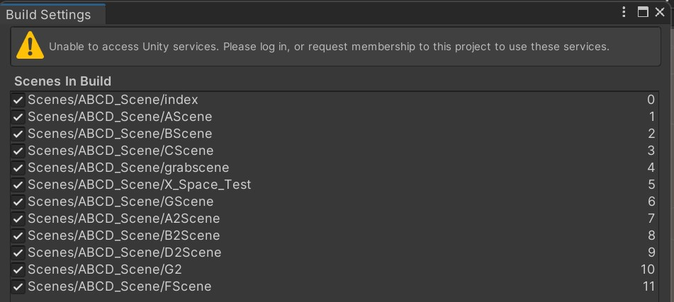

<!--_color: pink-->
### Unity
# Project_VR_shared_space

---

## Index <!--_color: pink-->
#### Scene 정리
- ABCD scenes table 

---
<!--_color: pink-->
# ABCD Scenes
---

File_name| Screenshoot | Explanation
---------|:-------------------------------:|:-----
index |  | 시작하는 곳.
AScene |  | 라인.
A2Scene |  | 인트로.

---

File_name| Screenshoot | Explanation
---------|:-------------------------------:|:-----
BScene|  | 픽셀.
B2Scene|  | 네트워크.
CScene |  | 가상.

---

File_name| Screenshoot | Explanation
---------|:-------------------------------:|:-----
DScene |  | 프레임.
D2Scene |  | 가상과 현실.
FScene |  | 로우 폴리곤.

---

File_name| Screenshoot | Explanation
---------|:-------------------------------:|:-----
GScene |  | 우주선 조립.
G2 |  | 전자기판 조립.
grabscene |  | 조립 테스트.

---

File_name| Screenshoot | Explanation
---------|:-------------------------------:|:-----
Practice_Light|  | 발사 테스트.
spaecShip|  | 우주선 에셋.
X_Space_Test |  | 공간 테스트.

---

# Build Settings
#####  경로: 위치: [파일]-'Build settings'

---

Scene number 

---

project window | assets > script > sceneChanger.cs

---

### Errors
<!--_color: yellow-->
###### Case 1)

 
-해결방법: Project-Oculus-VR-Plugins 에서 1.74.0만 남겨두고 나머지 삭제.

---

- ##### 해결 후 화면: 
 
: plugin 안에 2개의 파일만 존재한다.

---

# 문서정리

---

#### 1. 시작하는 곳 (왜 비트월드를 만들게 되었는지)

- 전시의도: 디지털 게임을 소재로 '비트'로 만들어진 가상세계를 구축하여 그곳과 소통하는 다양한 기술들, 가상세계 속 이야기들을 다루려고 한다.

---

#### 2. 인트로

---

#### 3. 라인

---

#### 4. 전자기판 조립

---

#### 5. 픽셀

---

#### 6. 우주선 조립

---

#### 7. 네트워크

---

#### 8. 가상과 현실

---

#### 9. 시작하는 곳

---