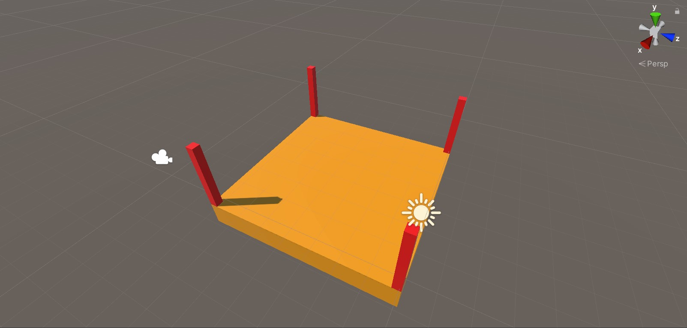
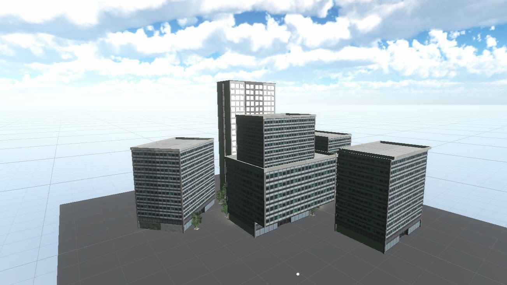
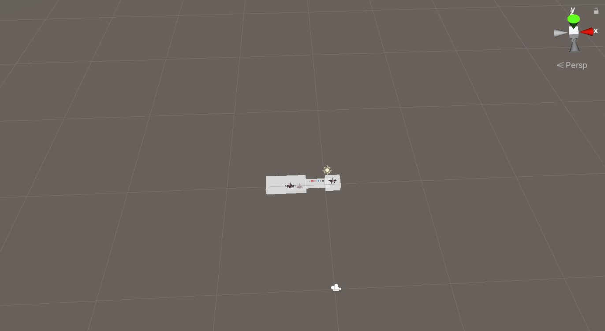
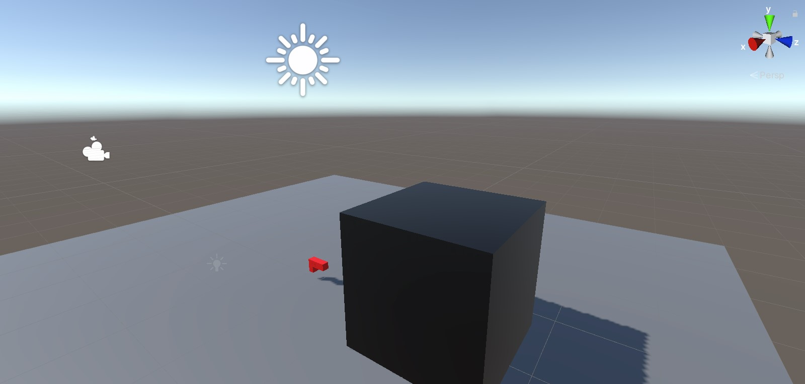
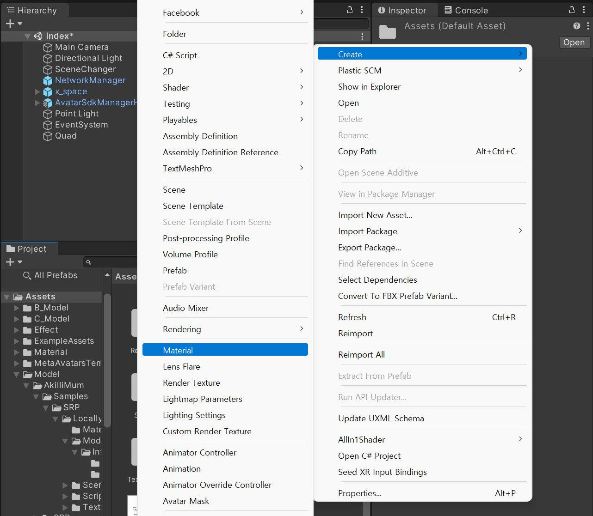
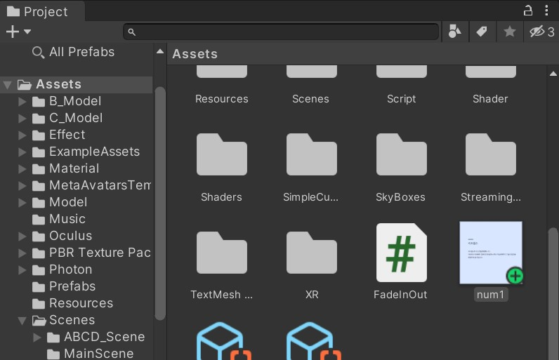
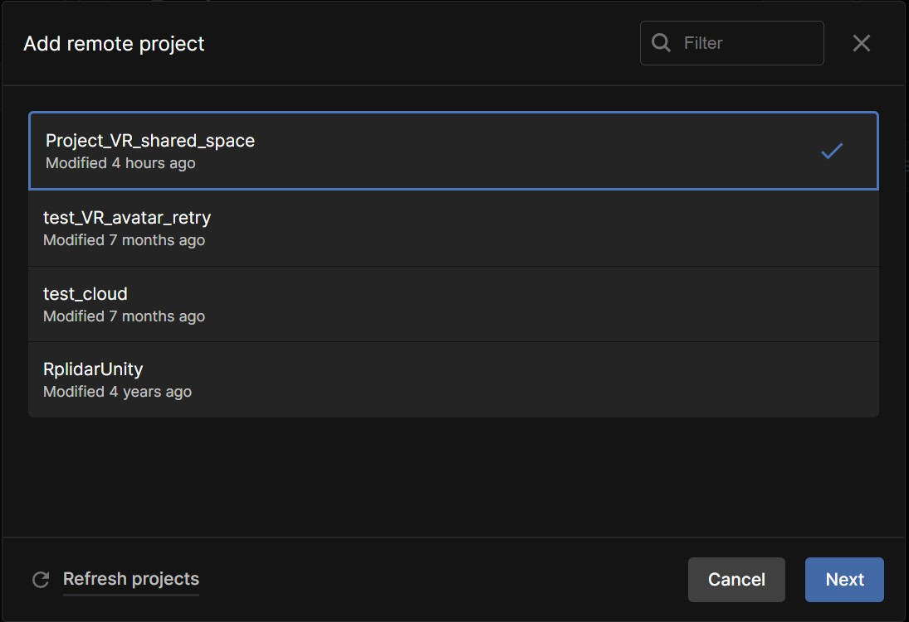

<!--_color: pink-->
### Unity
# Project_VR_shared_space

---

## Index <!--_color: pink-->
#### Scene 정리
- ABCD scenes table 

---
<!--_color: pink-->
# ABCD Scenes
---

File_name| Screenshoot | Scene_name
---------|:-------------------------------:|:-----
index |  | ■ 비트월드.
AScene |  | ■ 음극선관.
A2Scene |  | 인트로.

---

File_name| Screenshoot | Scene_name
---------|:-------------------------------:|:-----
BScene   | | ■ LED.
B2Scene|  | ■ 네트워크.
CScene |  | 가상.

---

File_name| Screenshoot | Scene_name
---------|:-------------------------------:|:-----
DScene |  | 프레임.
D2Scene |  | ■ 가상 현실.
FScene |  | 로우 폴리곤.

---

File_name| Screenshoot | Scene_name
---------|:-------------------------------:|:-----
GScene |  | ■ 인터넷.
G2 |  | ■ 트랜지스터.
grabscene |  | 조립 테스트.

---

File_name| Screenshoot | Scene_name
---------|:-------------------------------:|:-----
Practice_Light|  | 발사 테스트.  
spaecShip|  | 우주선 에셋.
X_Space_Test |  | 공간 테스트.

---

# Build Settings
#####  경로: 위치: [파일]-'Build settings'

---

Scene number 

---

project window | assets > script > sceneChanger.cs

---
<!--_color: pink-->

#####  Quad 를 사용하여 이미지 첨부하는 방법!

###### 1. 하이라키 창에서 우클릭- 3D Object - Quad 클릭

구글 업로드 해서 사진 바꾸기!!

---

###### 2. Project 창에서 우클릭- Create - Material

---

###### 3. 내가 만든 Material을 클릭- Inspector 창에서 윗 부분에 shader 칸에서 '**Universal Render Pipeline**' 클릭 

---
###### 4. Lit(기본설정) -> 'Unlit'으로 바꿔주기
- ###### Lit- 조명의 영향 O
- ###### Unlit- 조명의 영향X

---

###### 5. Inspector 창의 밑 부분에 Surface Inputs-     Base Map에 원하는 이미지 드래그 해서 가져오기.(끝)

---
<!--_color: pink-->
#####  UI 사용하여 이미지 첨부하기

1. 

---
2.

---

3.

---

4. 이미지 첨부 완료.

---

#####  Quad 를 사용하여 이미지 첨부하는 방법!

###### 1. 하이라키 창에서 우클릭- 3D Object - Quad 클릭

구글 업로드 해서 사진 바꾸기!!

---

###### 2. Project 창에서 우클릭- Create - Material

---

###### 3. 내가 만든 Material을 클릭- Inspector 창에서 윗 부분에 shader 칸에서 '**Universal Render Pipeline**' 클릭 

---
###### 4. Lit(기본설정) -> 'Unlit'으로 바꿔주기
- ###### Lit- 조명의 영향 O
- ###### Unlit- 조명의 영향X

---

###### 5. Inspector 창의 밑 부분에 Surface Inputs-     Base Map에 원하는 이미지 드래그 해서 가져오기.(끝)

---

### Unity Errors 모음
<!--_color: yellow-->
Case 1)

 
-해결방법: Project-Oculus-VR-Plugins 에서 1.74.0만 남겨두고 나머지 삭제.

---

- ##### 해결 후 화면: 
 
: plugin 안에 2개의 파일만 존재한다.

---

<!--_color: yellow-->

case 2)
- 프로젝트 동기화가 되지 않을 때

######  1. 유니티 허브 상에서 맨 밑의 주소를 확인한 다음,저장되어 있는 주소로 찾아가서 프로젝트 폴더를 지운다.

---
<!--_color: yellow-->
###### 2. 유니티 허브에서 open 버튼을 눌러 Open remote project를 누른다.

---
<!--_color: yellow-->

###### 3. 해당 폴더를 클릭하고 Next 버튼을 누른다.

---
<!--_color: yellow-->

###### 4. Open with '해당 버전' 버튼을 누른다.

---
# 폰트 목록

- 사이트: 눈누 https://noonnu.cc/

1. 나눔 바른 고딕
https://noonnu.cc/font_page/36

2. 나눔고딕코딩
https://noonnu.cc/font_page/40

---

3. 한림고딕체 
https://noonnu.cc/font_page/877

4. KoddiUD 온고딕
https://noonnu.cc/font_page/674

---

5. 예스 고딕
https://noonnu.cc/font_page/404

https://www.relation.co.kr/html_board/board_view.php?par_no=13&code=&title_code=&page=1&no=144

---

- 사이트: Relation 
https://www.relation.co.kr/html_board/board_view.php?par_no=13&code=&title_code=&page=1&no=144

1. ELAND Choice

###### https://www.relation.co.kr/html_board/board_view.php?par_no=13&code=&title_code=&page=1&no=144

---

2. KOHI 나눔체

###### https://www.relation.co.kr/html_board/board_view.php?par_no=13&code=&title_code=&page=1&no=152

---

3. KOHI 나눔체